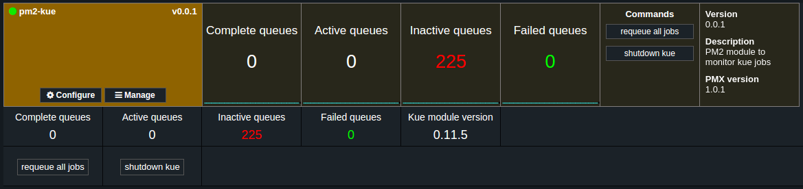

# pm2-kue

[](http://unmaintained.tech/)

[![npm version][version-badge]][version-url]
[![Known Vulnerabilities][vulnerabilities-badge]][vulnerabilities-url]
[![dependency status][dependency-badge]][dependency-url]
[![devdependency status][devdependency-badge]][devdependency-url]
[![downloads][downloads-badge]][downloads-url]

[![NPM][npm-stats-badge]][npm-stats-url]

> [PM2 module](https://app.keymetrics.io) to monitor **[kue](https://www.npmjs.com/package/kue)** jobs.

<p align="center">== DISCLAIMER ! ==</p>

This project is unmaintained. The reason why is that I was developing this PM2 module with the purpose to visualize datas in the [Keymetrics](https://app.keymetrics.io) dashboard. Now that [**Keymetrics restricted the amount of visible processes**](https://keymetrics.io/pricing) (also, PM2 modules), I don't see why I should maintain something that can only be available to paid Keymetrics users.

I maybe will restart this project once a full and free (or maybe **LESS EXPENSIVE**) Keymetrics alternative gets released.



This module aims to provide a minimalistic overview of the current jobs. If you want more details about your queues, check **[kue-ui](https://github.com/stonecircle/kue-ui)**.

## Installation

Run :

```bash
pm2 install pm2-kue
```

## LICENSE

**MIT License**

Copyright (c) 2017 **Nicolas COUTIN**

Permission is hereby granted, free of charge, to any person obtaining a copy
of this software and associated documentation files (the "Software"), to deal
in the Software without restriction, including without limitation the rights
to use, copy, modify, merge, publish, distribute, sublicense, and/or sell
copies of the Software, and to permit persons to whom the Software is
furnished to do so, subject to the following conditions:

The above copyright notice and this permission notice shall be included in all
copies or substantial portions of the Software.

THE SOFTWARE IS PROVIDED "AS IS", WITHOUT WARRANTY OF ANY KIND, EXPRESS OR
IMPLIED, INCLUDING BUT NOT LIMITED TO THE WARRANTIES OF MERCHANTABILITY,
FITNESS FOR A PARTICULAR PURPOSE AND NONINFRINGEMENT. IN NO EVENT SHALL THE
AUTHORS OR COPYRIGHT HOLDERS BE LIABLE FOR ANY CLAIM, DAMAGES OR OTHER
LIABILITY, WHETHER IN AN ACTION OF CONTRACT, TORT OR OTHERWISE, ARISING FROM,
OUT OF OR IN CONNECTION WITH THE SOFTWARE OR THE USE OR OTHER DEALINGS IN THE
SOFTWARE.

[version-badge]: https://img.shields.io/npm/v/pm2-kue.svg
[version-url]: https://www.npmjs.com/package/pm2-kue
[vulnerabilities-badge]: https://snyk.io/test/npm/pm2-kue/badge.svg
[vulnerabilities-url]: https://snyk.io/test/npm/pm2-kue
[dependency-badge]: https://david-dm.org/ilshidur/pm2-kue.svg
[dependency-url]: https://david-dm.org/ilshidur/pm2-kue
[devdependency-badge]: https://david-dm.org/ilshidur/pm2-kue/dev-status.svg
[devdependency-url]: https://david-dm.org/ilshidur/pm2-kue#info=devDependencies
[downloads-badge]: https://img.shields.io/npm/dt/pm2-kue.svg
[downloads-url]: https://www.npmjs.com/package/pm2-kue
[npm-stats-badge]: https://nodei.co/npm/pm2-kue.png?downloads=true&downloadRank=true
[npm-stats-url]: https://nodei.co/npm/pm2-kue
